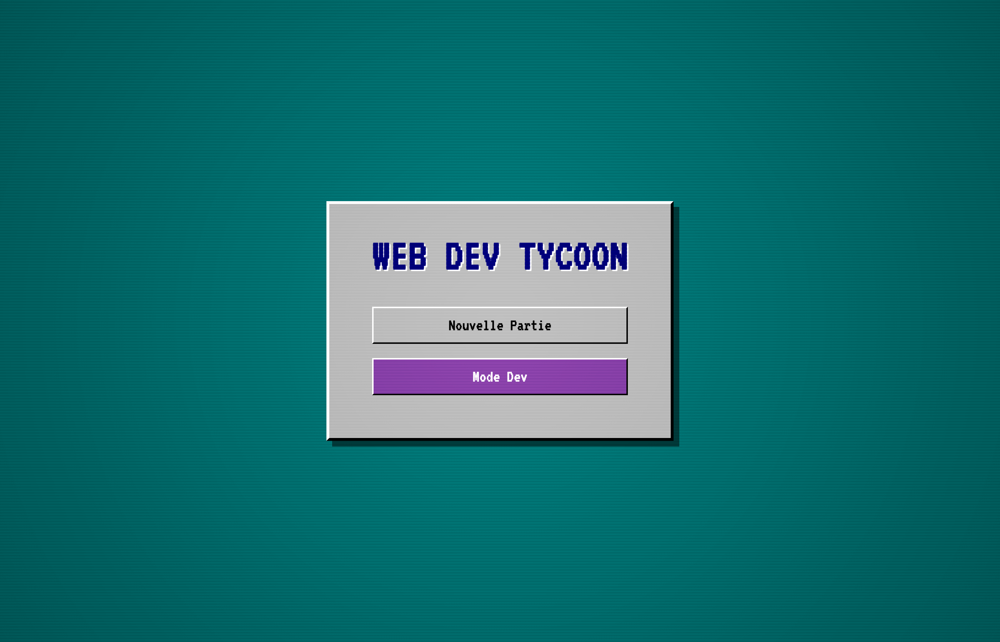
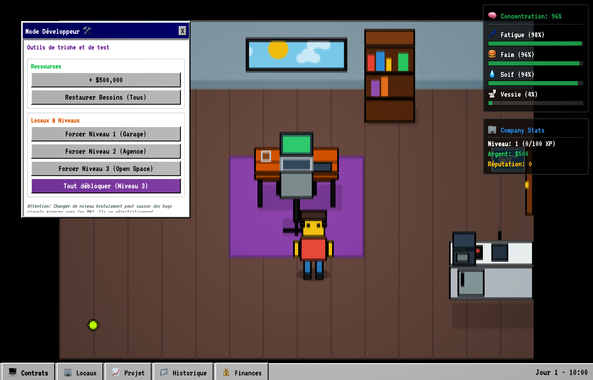
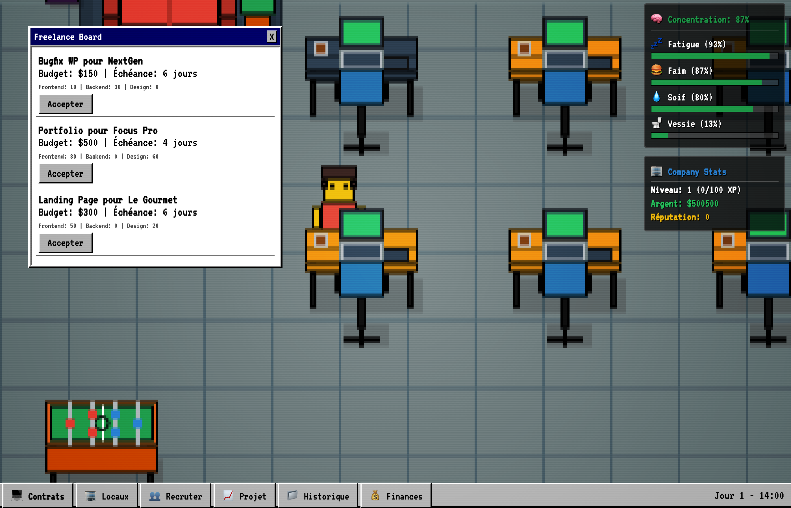
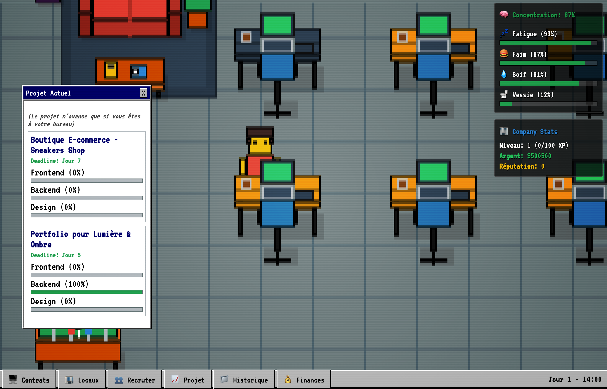

# Web Dev Tycoon

A browser management game about running a web agency, drawn entirely in pixel art on a Canvas 2D and wrapped in a 90s-desktop UI (draggable windows, CRT effect). Start alone in a garage, take freelance contracts, keep your character fed and rested, hire developers and grow into an agency and then an open space.

> The game text is in French.

## Screenshots

*All clients, contracts and employees are generated by the game.*

| Title screen | Starting in the garage (dev mode panel open) |
| --- | --- |
|  |  |

| Freelance board | Projects in progress |
| --- | --- |
|  |  |

## Gameplay

- **Contracts**: accept freelance jobs with a budget, a deadline and frontend / backend / design workloads.
- **Needs**: concentration, fatigue, hunger, thirst and bladder drive what your character does during the day.
- **Hiring**: recruit developers, a sales director (auto-accepts contracts), an operations director, an assistant and a cleaner.
- **Real estate**: move from the garage to an agency, then an open space; buy extra desks and departments (finance, datacenter, research, university).
- **Finances and history** windows, save / load, audio settings.
- **Dev mode** from the title screen: add money, restore needs, force an office level.

## Tech

- TypeScript (strict) + Vite, no framework
- Custom ECS built on [bitecs](https://github.com/NateTheGreatt/bitECS)
- Everything is procedural: sprites are drawn with the Canvas 2D API and all music and sound effects are synthesised with the Web Audio API — the repo contains no image or audio assets.

## Getting started

```bash
npm install
npm run dev      # http://localhost:5173
npm run build    # type-check + production build in dist/
```

Or with Docker: `docker compose up --build`, then open <http://localhost:3015>.

## Project structure

```
src/
├── core/    # game loop, time, event bus
├── sim/     # ECS components and systems, game state
├── render/  # procedural pixel-art renderer
├── ui/      # window manager and desktop UI
├── audio/   # Web Audio synthesiser
├── data/    # contracts and other game data
└── save/    # save / load
```
